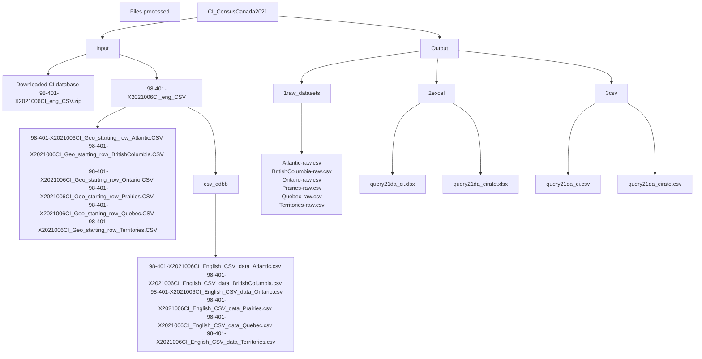

# Extracting variables of Interest for Confidence Interval Census 2021 Canada - Dissemination Area scales

### Introduction 

A lot of the 2021 Census variables do not show up the 100% of the population, rather it responds to a small sample that expresses an uncertainty in their values that can be managed with a *Confidence Interval (CI)*. **Stats Canada** has published an article *Why to use Confidence Interval* [Understanding Confidence Intervals (CI)](https://www12.statcan.gc.ca/census-recensement/2021/ref/98-20-0001/982000012021003-eng.cfm). To date (February 2023) is hard to obtain these databases in *data frames* format, it is because the original databases come in sort of huge cross tables that, would require to be manipulated in database management as **PostgreSQL** or any other.

This **Github** repository stores the code that allows extracting specific variables, however, its documentation works as a methodology to follow up if other variables are required to extract.

### Part 1: Creating the environment to extract data.

#### Setting up directories

First of all, is necessary to create an *input* and an *output* folder. I use this structure because I think that is more convenient to order the code. In the input folder will be unzipped the downloaded file *`98-401-X2021006CI_eng_CSV.zip`* creating a folder with the same name (*98-401-X2021006CI_eng_CSV* ) and, there just will remain the files that indicate the rows (*...CI_Geo_starting_row_Province.CSV* pattern). We will create inner the mentioned folder a new one, called `csv_ddbb`, and we will cut and copy the *csv* files that contain the data of interest (*...English_CSV_data_Province.csv* pattern).   

#### Downloading and unzipping the data
The dataset content will be downloaded from [StatsCanada](https://www12.statcan.gc.ca/census-recensement/2021/dp-pd/prof/details/download-telecharger.cfm?Lang=E)

```R
 #Chunk: 0-1
library(RPostgreSQL)
library(dplyr)
library(tidyverse)
library(DBI)


dir.create('input')
dir.create('output')
dir.create('output/1raw_datasets')
dir.create('output/2excel')
dir.create('output/3csv')
options(timeout = max(300, getOption("timeout"))) #I expand the time to keep downloading a file 
download.file('https://www12.statcan.gc.ca/census-recensement/2021/dp-pd/prof/details/download-telecharger/comp/GetFile.cfm?Lang=E&FILETYPE=CSV&GEONO=006',"input/98-401-X2021006CI_eng_CSV.zip", cacheOK=FALSE, mode = 'wb') #Downloading the file
fold1 <- 'input/98-401-X2021006CI_eng_CSV' #Create the address where I will create a folder to unzip the downloaded file
dir.create(fold1)

fold2 <- 'input/98-401-X2021006CI_eng_CSV/csv_ddbb/'
dir.create(fold2)

unzip("input/98-401-X2021006CI_eng_CSV.zip",exdir= fold1)

move <- dir(fold1)[1:6]

lapply(move, function(x){library(filesstrings)
  file.move(paste0(here::here(),'/',fold1,"/",x),
            fold2)})
```

The structure of our work folders will be the next:



#### Establishing connection with Postgres SQL 

It will be necessary to have installed **Postgres SQL** and already created a database, in this case, called censos. Also, you will need to provide a user, password, and if you want a possible schema to make the connection. 

```R
 #Chunk: 2

fun_connect<-function(){dbConnect(RPostgres::Postgres(),
                                  dbname='censos',
                                  host='localhost',
                                  port=5432,
                                  user='postgres',
                                  password='adminpass',
                                  options= '-c search_path=censos')}

conn<-fun_connect()

```
#### Compressing- Deleting raw files and Getting the names
Before creating our tables in **Postgres SQ*L* will be necessary to compress the files in **.7z** format because thanks to this format we can load heavy datasets in **Postgres SQL**. Also, will be necessary to delete the *.csv* files that contain the original data. In this way, we can obtain all the names of the **.7z** files in this folder and load the data automatically in **Postgres SQL**.

##### Creating the 7zip
```R
 #Chunk: 3
lapply(move, function(x){
  system(
  paste0('7z a \"', str_replace_all(here::here(),"/","\\\\"),'\\\\', str_replace_all(fold2,"/","\\\\" ),str_remove(x,'.csv'),'.7z\" ',
         paste0('\"',str_replace_all(here::here(),"/","\\\\"),'\\\\', str_replace_all(fold2,"/","\\\\" ), x),'\"'),
  intern=F,
  ignore.stdout = F,
  ignore.stderr = F,
  wait=T)})
```
##### Removing the .csv files
```R
 #Chunk: 4
lapply(move,function(x){unlink(paste0(here::here(),'/',fold2,x))})
```


##### Obtaining the file names to load the data
Here, we are creating an identifier to automatize the process when we will create the table and load them.
```R
 #Chunk: 5
file_name<-dir(paste0(here::here(),"/input/98-401-X2021006CI_eng_CSV/csv_ddbb")[1:6])
provinces<-sub(".*data_", "", file_name)
provinces<-sub(".7z*", "", provinces) 
provinces_file<-data.frame(file=file_name,provinces=provinces)
```

#### Creating tables queries
In this step, we will create the tables to load the data of our **.7zip** files. Here we store the queries for each dataset through the `lapply` function using the names stored in the above step. 

```R
#Chunk: 6
create_table<-lapply(provinces,function(x){paste0("CREATE TABLE ",x," (id SERIAL PRIMARY KEY,
CENSUS_YEAR VARCHAR(50),
DGUID VARCHAR(100),
ALT_GEO_CODE VARCHAR(100),
GEO_LEVEL VARCHAR(100),
GEO_NAME VARCHAR(100),
TNR_SF VARCHAR(100),
TNR_LF VARCHAR(100),
DATA_QUALITY_FLAG VARCHAR(100),
CHARACTERISTIC_ID VARCHAR(100),
CHARACTERISTIC_NAME VARCHAR(200),
CHARACTERISTIC_NOTE VARCHAR(200),
C1_COUNT_TOTAL VARCHAR(50),
SYMBOL1 VARCHAR(10),
\"C2_COUNT_MEN+\" VARCHAR(50),
SYMBOL2 VARCHAR(10),
\"C3_COUNT_WOMEN+\" VARCHAR(50),
SYMBOL3 VARCHAR(10),
C4_COUNT_LOW_CI_TOTAL VARCHAR(50),
SYMBOL4 VARCHAR(10),
\"C5_COUNT_LOW_CI_MEN+\" VARCHAR(50),
SYMBOL5 VARCHAR(10),
\"C6_COUNT_LOW_CI_WOMEN+\" VARCHAR(50),
SYMBOL6 VARCHAR(10),
C7_COUNT_HI_CI_TOTAL VARCHAR(50),
SYMBOL7 VARCHAR(10),
\"C8_COUNT_HI_CI_MEN+\" VARCHAR(50),
SYMBOL8 VARCHAR(10),
\"C9_COUNT_HI_CI_WOMEN+\" VARCHAR(50),
SYMBOL9 VARCHAR(10),
C10_RATE_TOTAL VARCHAR(50),
SYMBOL10 VARCHAR(10),
\"C11_RATE_MEN+\" VARCHAR(50),
SYMBOL11 VARCHAR(10),
\"C12_RATE_WOMEN+\" VARCHAR(50),
SYMBOL12 VARCHAR(10),
C13_RATE_LOW_CI_TOTAL VARCHAR(50),
SYMBOL13 VARCHAR(10),
\"C14_RATE_LOW_CI_MEN+\" VARCHAR(50),
SYMBOL14 VARCHAR(10),
\"C15_RATE_LOW_CI_WOMEN+\" VARCHAR(50),
SYMBOL15 VARCHAR(10),
C16_RATE_HI_CI_TOTAL VARCHAR(50),
SYMBOL16 VARCHAR(10),
\"C17_RATE_HI_CI_MEN+\" VARCHAR(50),
SYMBOL17 VARCHAR(10),
\"C18_RATE_HI_CI_WOMEN+\" VARCHAR(50),
SYMBOL18 VARCHAR(10))")})
````

#### Sending queries to create tables

In this step, we send the query for each table. Maybe you would wonder why am I not using the `lapply` function, and is because it does not work. *I think that I should report this to the package **RPostgreSQL** or **DBI**.*

````R
#Chunk: 7
dbSendQuery(conn,create_table[[1]])#Atlantic
dbSendQuery(conn,create_table[[2]])#BritishColumbia
dbSendQuery(conn,create_table[[3]])#Ontario
dbSendQuery(conn,create_table[[4]])#Prairies
dbSendQuery(conn,create_table[[5]])#Quebec
dbSendQuery(conn,create_table[[6]])#Territories
````

#### Loading tables with data

Now, all the effort that we did before building our folder structure, moving heavy files, compressing in a specific format, and removing other ones has resulted. Because is the moment to create the query to load the data. One database query for each list element because as I said before, loading with `dbSendQuery` doesn't work with `lapply()`.

```R
#Chunk: 8
provinces_file<-data.frame(file=file_name,provinces=provinces)

load_data<-list()
for (i in 1:nrow(provinces_file)){
b<-paste0("copy censos.",provinces_file$provinces[i] ," (CENSUS_YEAR,
          DGUID,
          ALT_GEO_CODE,
          GEO_LEVEL,
          GEO_NAME,
          TNR_SF,
          TNR_LF,
          DATA_QUALITY_FLAG,
          CHARACTERISTIC_ID,
          CHARACTERISTIC_NAME,
          CHARACTERISTIC_NOTE,
          C1_COUNT_TOTAL,
          SYMBOL1,
          \"C2_COUNT_MEN+\",
          SYMBOL2,
          \"C3_COUNT_WOMEN+\",
          SYMBOL3,
          C4_COUNT_LOW_CI_TOTAL,
          SYMBOL4,
          \"C5_COUNT_LOW_CI_MEN+\",
          SYMBOL5,
          \"C6_COUNT_LOW_CI_WOMEN+\",
          SYMBOL6,
          C7_COUNT_HI_CI_TOTAL,
          SYMBOL7,
          \"C8_COUNT_HI_CI_MEN+\",
          SYMBOL8,
          \"C9_COUNT_HI_CI_WOMEN+\",
          SYMBOL9,
          C10_RATE_TOTAL,
          SYMBOL10,
          \"C11_RATE_MEN+\",
          SYMBOL11,
          \"C12_RATE_WOMEN+\",
          SYMBOL12,
          C13_RATE_LOW_CI_TOTAL,
          SYMBOL13,
          \"C14_RATE_LOW_CI_MEN+\",
          SYMBOL14,
          \"C15_RATE_LOW_CI_WOMEN+\",
          SYMBOL15,
          C16_RATE_HI_CI_TOTAL,
          SYMBOL16,
          \"C17_RATE_HI_CI_MEN+\",
          SYMBOL17,
          \"C18_RATE_HI_CI_WOMEN+\",
          SYMBOL18) 
          FROM PROGRAM '7z e -so", paste0(here::here(), "/input/98-401-X2021006CI_eng_CSV/csv_ddbb/"),provinces_file$file[i],"' DELIMITER ',' CSV HEADER encoding 'windows-1251';")
load_data[[i]]<-b
}
````

#### Counting how many rows each database

Ok, our databases should be loaded in our *SQL Database manager*, in this case, a.k.a **Postgres SQL*, so we will count the rows of each table and contrast this information with the original excel file that counts the rows.

```R
#Chunk: 9
nrow_query<-list()
for (i in 1:length(provinces)){
query<-dbSendQuery(conn, paste0("SELECT count(*) FROM censos.",tolower(provinces[i])))
nrow_query[[i]]<-dbFetch(query)
}

nrow_query[1]
nrow_query[2]
nrow_query[3]
nrow_query[4]
nrow_query[5]
nrow_query[6]


b<-c()
for (i in 1:length(nrow_query)){
  a<-nrow_query[[i]]$count
  b[[i]]<-a
}

library(bit64)

counts <- sapply(nrow_query, function(x){x/1}) #See how many rows has each dataset (table)

sum(unlist(t(counts))) #Count rows 

```

#### Pause: comments

I tried to unite the table and do the query from there but it results were very heavy for the computer. To query a table like this on a bigger computer is possible to use Amazon Web Services how I will explain this in the future, in another [tutorial-documentation (https://github.com/bwcastillo/doc-postgresqlandr). Is possible to see how to join the tables when I tried to extract information there, in the file `1_connection_setup.R`, and after how I tried to extract the data in the file `2_bigQuery.R`.


### Part2: Extracting data

#### Creating an index to identify the variables

It was necessary to build an index to identify the variables that we are looking for... what does it mean? This index allows us to extract the variables in each database, so is a necessary reference to its id (*SERIAL PRIMARY KEY*) and name description. The problem is that these identifiers are not sorted, if you realize the variables in the file `98-401-X2021006CI_English_meta.txt` 1624 variables are numbered from 126 to 2623... ok, what is the problem with this? If you subtract 126 from 2623 is equal to 2497 and not 1624, damn! So what was done, was obtain the columns `id` and `characteristic_id` from one of the tables, after just selecting the first 1624 rows, after that was added a column with a sequential index from 1 to 1624 besides the original one, so in that way, we could know what is the original number of each variable. After that, it was filtered this index with the original position of the 14 variables that we are interested in, described in the table below. Finally, we can consider other possible alternatives, select the original Id, identify where are the breaks, and create an index from there, or maybe query for the name of the variable.  

#### Subseting the index

We just identified 14 variables of interest for our study.

|N°| N° Index Original  | N° Index Database (PostgreSQL) |  Variable Description| 
|:------------- |:-------------:|:-------------:| :-----:|
|1| 135 | 10 |**Number of government transfers recipients aged 15 years and over in private households in 2020 - 25% sample data** |
|2| 1416 | 417|Total - Private households by tenure - 25% sample data (50) - **Renter**|
|3| 1439 | 440|Total - Private households by housing suitability - 25% sample data (55) - <br> **Not suitable**|
|4| 1441 | 442|Total - Occupied private dwellings by period of construction - 25% sample data (56) - <br>**1960 or before**|
|5| 1451 | 452|Total - Occupied private dwellings by dwelling condition - 25% sample data (58) - <br>**Major repairs needed**|
|6| 1467 | 468|Total - Owner and tenant households with household total income greater than zero, in non-farm, non-reserve private dwellings by shelter-cost-to-income ratio - 25% sample data (61) -<br> **Spending 30% or more of income on shelter costs**|
|7| 1488 | 489|Total - Owner households in non-farm, non-reserve private dwellings - 25% sample data (66) -<br> **Median value of dwellings ($)** |
|8| 1536 | 537|Total - Immigrant status and period of immigration for the population in private households -<br> **25% sample data (79) - 2016 to 2021** |
|9| 1695 | 696|Total - Visible minority for the population in private households - 25% sample data (117) -<br>  **Multiple visible minorities**|
|10| 1976 | 977|Total - Mobility status 1 year ago - 25% sample data (163) -<br> **Movers**|
|11| 1999 | 1000|Total - Highest certificate, diploma or degree for the population aged 15 years and over in private households - 25% sample data (165) -<br> **No certificate, diploma or degree**|
|12| 2226 | 1227|Total - Population aged 15 years and over by labour force status - 25% sample data (184) -<br> **Unemployed**|
|13| 2227 | 1228|Total - Population aged 15 years and over by labour force status - 25% sample data (184) -<br> **Not in the labour force**|
|14| 2607 | 1608|Total - Main mode of commuting for the employed labour force aged 15 years and over with a usual place of work or no fixed workplace address - 25% sample data (200) -<br> **Public transit**|

#### Obtaining the Dissemination Areas 
The dataset does not include only the *Dissemination Areas* if not other types of aggregations. So with the file that contains the positions of each geographic area with extract the Dissemination Areas. 

```R
#Chunk: 10
names_georow<-dir(paste0(here::here(),"/input/98-401-X2021006CI_eng_CSV"))[2:7]

georows<-lapply(names_georow, function(x){read.csv(paste0(here::here(),"/input/98-401-X2021006CI_eng_CSV/",x))})

```
#### Creating an index 

In this section is created the index how was described at the begin of this second part. But also is important consider that the first next chunk that store the variable `index` is where you should to put the variables that you are interested in, how was described in the table above.
```R
#Chunk: 11
index<-c(135,1416,1439,1441,1451,1467,1488,1536,1695,1976,1999,2226,2227,2607)#14
```

```R
#Chunk: 12
bigIndex<- dbSendQuery(conn, "SELECT id, characteristic_id FROM  censos.atlantic ORDER BY ID")
bigIndex<- dbFetch(bigIndex) #
bigIndex$characteristic_id <- as.numeric(bigIndex$characteristic_id)

bigIndex <- bigIndex[1:1624,]

bigIndex_of<-data.frame(id=bigIndex$id,iddb=bigIndex$characteristic_id)

index<-bigIndex_of[bigIndex_of$iddb%in%index,]
```

#### Creating an index for each table
With the index created above, now we create a specific length index for each one of the tables.

```R
#Chunk: 13
da_position<-lapply(georows,function(x){
  vector <-c() 
  for (i in 1:nrow(x)){ 
          a<-index$id+1624*i
          vector[[i]]<-a
  }
  vector<-c(index$id,vector) #I added a vector because 'a' start to count where the row finish
  vec <- Reduce(c,vector)})

gc()
```

#### Two ways to query the tables:  1) just to do one *SQL* query for a lighter table or, 2) iterate queries for each row, a method for longer tables.

##### First way to query for our variables of interest
This path will be used to query lighter tables, this method creates a list that contains all the queries for each province.

```R
#Chunk: 14
dbQuery<-list()
for(i in 1:6){
a<-paste(paste0("SELECT * 
          FROM censos.",provinces[[i]]),"
         WHERE",paste('id IN (',
          paste(da_position[[i]], collapse=",")
                 ),") ORDER BY ID;")
dbQuery[[i]]<-a
}
```


##### Second way, is a mutant function that does everything
This second way perhaps is not so fancy, but obtain the result and avoid some boring steps if we include them in a function. Basically, we create a function that does the next:

1. Create chunks, which means that for each *Dissemination Area* identify what rows need to extract to get the wanted variables. 
2. After Making the query into two parts
3. We extract from the list and returned what we want
4. From list to a data frame
5. Join both data frame
6. Done

```R
#Chunk: 15
get_data_chunk<-function(x,y){
  # Doing chunks 
  index<-split(da_position[[x]],ceiling(seq_along(da_position[[x]])/14)) #Change '14' for number of variables


  # Creating queries by each chunk 
  chunks<-lapply(index,function(x){
  paste(paste0("SELECT *
          FROM censos.",y),"
         WHERE",paste('id IN (',
                      paste(x, collapse=",")
         ),") ORDER BY ID;")})


  # Doing and collecting data in two sets through chunks 
  query<-list()
  for (i in 1:10000) {
    x<-dbSendQuery(conn, chunks[[i]])
    x<-dbFetch(x)
    query[[i]]<-x
  }
  
  query_2<-list()
  for (i in 10001:length(index)) {
    x<-dbSendQuery(conn, chunks[[i]])
    x<-dbFetch(x)
    query_2[[i]]<-x
  }

  # Extracting the part of the list of or interest 
  # query_2<-query_2[10001:length(index)-14] #nrow with the original nrow count
  query_2<-query_2[10001:length(index)-1] #nrow with the original nrow count

  #bind rows 
  query<-bind_rows(query)
  query_2<-bind_rows(query_2)

  # Joining the two sets
  q<-rbind(query,query_2)
  
  write.csv(q,paste0("output/1raw_datasets/",y,"-raw.csv"))

  return(q)}
  ```

#### How to query?

So how do we know what method to use? It depends on the area and the capacity of your computer, in my case I am using a `Platform: x86_64-w64-mingw32/x64 (64-bit) Running under Windows 11 x64 (build 22621)` with `12gb RAM` and `500gb hard disk`. So, I did the queries as shown in the next table:

|N°| Province|Length Dissemination Areas|Length SQL Table| Function to query| Output name in R |
|:--|:-----: |:---:|:---:|:---:|:---:|
|1|Atlantic|5424|8808576|dbSendQuery()|data_a|
|2|British Columbia|8630|14015120|dbSendQuery()|data_bc|
|3|Ontario|21096|34259904|get_data_chunk()|q3|
|4|Prairies|12728|20670272|get_data_chunk()|q4|
|5|Quebec|15188|24665312|get_data_chunk()|q5|
|6|Territories|343|557032|dbSendQuery()|data_t|

#### Method 1: dbQuery()
Here, I am querying and saving the results for the lighter tables using the first method.
```R
#Chunk: 16
q1<-dbSendQuery(conn, dbQuery[[1]])
data_a<-dbFetch(q1)
write.csv(data_a,paste0("output/1raw_datasets/",provinces[[1]],"-raw.csv"))
rm(data_a,q1)          
gc()

q2<-dbSendQuery(conn, dbQuery[[2]])
data_bc<-dbFetch(q2)
write.csv(data_bc,paste0("output/1raw_datasets/",provinces[[2]],"-raw.csv"))
rm(data_bc,q2)
gc()

q6<-dbSendQuery(conn, dbQuery[[6]])
data_t<-dbFetch(q6)
write.csv(data_t,paste0("output/1raw_datasets/",provinces[[6]],"-raw.csv"))
```


#### Method 2: get_data_chunk()
The function `get_data_`chunk()` will be used for the heavier data set, in this case for Ontario, Prairies, and Quebec.

```R
#Chunk: 17
q3<-get_data_chunk(3,provinces[[3]])
q4<-get_data_chunk(4,provinces[[4]])
q5<-get_data_chunk(5,provinces[[5]])
```


### Part 3: Formating 

Finally, we will format the tables obtained. This is is an important step because we should remember that the data comes in an interesting format, sort of crossed tables, where for every 1624 rows a new geographic area starts. So essentially in this part, we will wider our tables, which means we will put the *'row variables'* as columns, obtaining a regular *data frame* that will allow us to have a better format to analyze the data of interest.

#### Creating a *Verifier* function

First, we create a function to verify that the variables obtained have kept the correct id. It will return us TRUE if all is right for each dataset.

```R
#Chunk: 18
verifier <- function(x){
  x$characteristic_id2<-rep(c(135,1416,1439,1441,1451,1467,1488,1536,1695,1976,1999,2226,2227,2607), nrow(x)/14)
  unique(x$characteristic_id==x$characteristic_id2) #Return true, and not true and false, all right}
  
verifier(data_a)
verifier(data_bc)
verifier(q3)
verifier(q4)
verifier(q5)
verifier(data_t)

dataset_ci <- rbind(data.frame(data_a,province="Atlantic"),
                    data.frame(data_bc,province="British Columbia"),
                    data.frame(q3,province="Ontario"),
                    data.frame(q4,province="Praires"),
                    data.frame(q5,province="Quebec"),
                    data.frame(data_t,province="Territories"))

verifier(dataset_ci)


```

#### 2. Slicing, sticking, wider
Finally, a lot of steps to format will be necessary, so before replicating each one of them to each data set is better to analyze what we will need to use, including these steps in a function and replicate it for each dataset. In this case, I identified 3 parts with different steps in each one of them.  

##### A. Slicing
1. We create the first which means selecting the variables of interest Count Total CI, Count Low CI, Count High CI.
2. Changing character as numeric.
3. Unnesting the numeric variables.

##### B. Sticking
1. Slicing to sticking to the Unnested x part of the dataset.
2. We create a column that contains the order of the variables. 
3. One new column that refers to the abbreviation name of each variable is created.
4. The name of the numeric variables of interest are changed.

##### C. Wider
1. We *Pivot Wider* the column that contains the variables.

Note:
*Be aware that here you should understand how I slice and stick the dataset because according to the number of variables that you choose will be necessary another index to *Slice*, *Stick*, and *Wide* the *dataframe*.*
```R
#Chunk: 19
  datascape <-  function(x){
    #Slice
    y <- x
    x<-x[,c(1:13,19,25)]  #Tricky step replicate first the example, and correct the index according you selection
    x<-mutate_if(x, cols=c(13:15),is.character,as.numeric)  #Tricky step replicate first the example, and correct the index according you selection
    x<-unnest(x[,13:15])  #Unnesting converted (char2num) cols
    
    #Sticker
    y<-y[,c(1:13,19,25,49)]  #Tricky step replicate first the example, and correct the index according you selection
    y$variables<-rep(c("GOVTRANSFER","RENTER","CROWDHOME", "BUILT1960","REPAIRHOME", #Change the name of variables according you selection
                       "SHLTCOSTR","MEDHOMVAL","RECENTIMMIGRANT","VISMIN_NIE",
                       "MOVERS","NONDEGREE","UNEMPLOYED","NILF","PUBTRANSIT"), nrow(x)/14)#Change '14' for the number of variables that you chose
    
    x<-data.frame(y[,c(2:6,16,17)],x) #Adding var to converted
    
    colnames(x)[7:10] <- c("ID", "TOTAL", "LOW_CI", "HIGH_CI")
    
    
    #Wider
    x<-pivot_wider(x,names_from=ID,values_from=c(8:10)) #Expanding dataset
    return(x)
  }
  
```

Now, we will apply this function to all the dataset `dataset_ci` joined in the last step above, and just the *Dissemination Areas* will be filtered. 

```R 
#Chunk: 20
prueba <- datascape(dataset_ci)
da2021 <- prueba[prueba$geo_level=="Dissemination area",]
```

**Voilá** our new dataset :P, but...! We should verify if the length match with the  [*Dissemination Area boundaries dataset*](https://www12.statcan.gc.ca/census-recensement/2021/geo/sip-pis/boundary-limites/index2021-eng.cfm?year=21)

```R
#Chunk: 21
download.file('https://www12.statcan.gc.ca/census-recensement/2021/geo/sip-pis/boundary-limites/files-fichiers/lda_000a21a_e.zip',"input/lda_000a21a_e.zip", cacheOK=FALSE, mode = 'wb') #Downloading the file
dir.create('input/lda_000a21a_e')
unzip("input/lda_000a21a_e.zip",exdir= 'input/lda_000a21a_e')
boundaries21<-sf::st_read(paste0(here::here(),"\\input\\lda_000a21a_e\\lda_000a21a_e.shp"))

da2021$dguid[!(da2021$dguid%in%unique(boundaries21$DGUID))] #PERFECT all the Dissemination Areas are included in the boundaries

```

#### BONUS: Replicate the same process for the Confidence Interval for Rates

Finally, we will replicate the same process for the Confidence Intervals of Rates. 

Note:
*Be aware that here you should understand how I slice and stick the dataset because according to the number of variables that you choose will be necessary another index to *Slice*, *Stick*, and *Wide* the *dataframe*.*

```R
#Chunk: 22

datascape_rates <-  function(x){
    #Slice
    y <- x
    x<-x[,c(1:12,31,37,43)] #Tricky step replicate first the example, and correct the index according you selection
    x<-mutate_if(x, cols=c(13:15),is.character,as.numeric)
    x<-unnest(x[,13:15])  #Unnesting converted (char2num) cols
    
    #Sticker
    y<-y[,c(1:12,31,37,43,49)] #Tricky step replicate first the example, and correct the index according you selection
    y$variables<-rep(c("GOVTRANSFER","RENTER","CROWDHOME", "BUILT1960","REPAIRHOME", #Change the name of variables according you selection
                       "SHLTCOSTR","MEDHOMVAL","RECENTIMMIGRANT","VISMIN_NIE", 
                       "MOVERS","NONDEGREE","UNEMPLOYED","NILF","PUBTRANSIT"), nrow(x)/14) #Change '14' for the number of variables that you chose 
    
    x<-data.frame(y[,c(2:6,16,17)],x) #Adding var to converted
    
    colnames(x)[7:10] <- c("ID", "TOTAL", "LOW_CI", "HIGH_CI")
    
    
    #Wider
    x<-pivot_wider(x,names_from=ID,values_from=c(8:10)) #Expanding dataset
    return(x)
  }

prueba_rate <- datascape_rates(dataset_ci)

da2021_rate <- prueba_rate[prueba_rate$geo_level=="Dissemination area",]
```

#### Final, Saving the datasets 

Finally, we will save our results in *.csv* and *.xlsx* format.
```R
#Chunk: 23

  #XLSX
  writexl::write_xlsx(da2021,paste0(here::here(),"\\output\\2excel\\query21da_ci.xlsx"))
  writexl::write_xlsx(da2021_rate,paste0(here::here(),"\\output\\2excel\\query21da_cirate.xlsx"))
  
  #CSV
  write.csv(da2021,paste0(here::here(),"\\output\\3csv\\query21da_ci.csv"))
  write.csv(da2021_rate,paste0(here::here(),"\\output\\3csv\\output\\3csv\\query21da_cirate.csv"))  
  
```

*Thank you :)!*


Acknowledge: This tutorial documentation is part of my work experience at [Partners for Action (P4A) - University of Waterloo](https://uwaterloo.ca/partners-for-action/)

PS: Any questions please feel free to write me to *bwcastillo@uc.cl*
